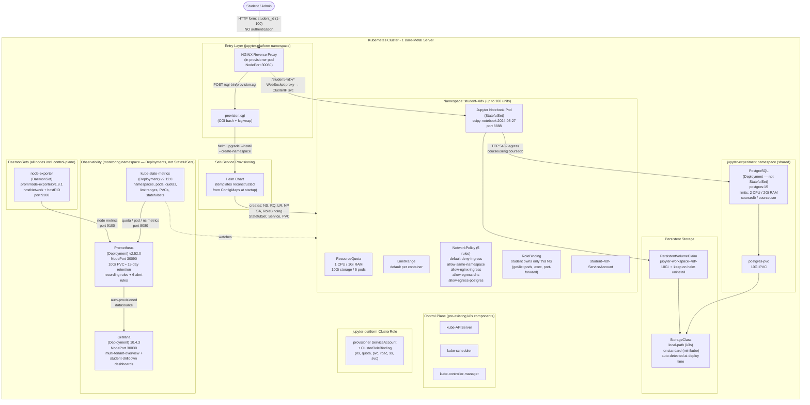

# Jupyter Server — Kubernetes Platform

A multi-tenant JupyterLab platform on Kubernetes where each student gets an isolated, resource-capped environment for coursework.

## Architecture



---

## Repository Layout

```
jupyter_platform/        Student provisioning portal
hard_limit_estimation/   Experiment for sizing CPU/RAM hard limits
monitoring/              Prometheus + Grafana observability stack
docs/                    Extended documentation
```

---

## jupyter_platform

A self-service provisioning portal. A student types their ID into a browser form and the platform spins up a fully isolated JupyterLab instance — dedicated namespace, hard resource quotas, persistent storage, and network policies — within seconds.

Each student namespace contains a `ResourceQuota`, `LimitRange`, five `NetworkPolicy` rules, a `PVC`, and a `StatefulSet`. Re-submitting the same ID is idempotent.

See [`jupyter_platform/README.md`](jupyter_platform/README.md) for deploy instructions, how to change resource limits, and Helm operations.

---

## hard_limit_estimation

An experiment used to find the minimum CPU and RAM that Jupyter and Postgres pods can tolerate before degrading under real coursework load. This informs the hard limit values set in `jupyter_platform`.

The experiment runs 14 stress scenarios (heavy SQL joins, pandas feature engineering, NumPy linear algebra, matplotlib rendering) against a seeded 100k-row database, then measures peak RSS and elapsed time at progressively tighter limits using a binary-search protocol.

See [`docs/hard-limit-estimation.md`](docs/hard-limit-estimation.md) for the full methodology and results.

---

## monitoring

A Prometheus + Grafana stack that watches the health and isolation of the platform.

- **node-exporter** (DaemonSet) — whole-node CPU, RAM, disk, network
- **kube-state-metrics** — per-namespace quota usage and pod state
- **cAdvisor** (via kubelet) — per-container actual CPU and RAM

Two pre-built Grafana dashboards are included:

| Dashboard | Purpose |
|---|---|
| Multi-Tenant Overview | All students at a glance — quota usage, noisy neighbours, OOMKills, orphaned namespaces |
| Student Drill-Down | Single student deep-dive with CPU/RAM trend lines and headroom gauges |

Alerting rules fire on quota near-limit (>80%), hard limit hit, OOMKill, node memory pressure (>90%), and orphaned namespaces idle >1 h.

See [`docs/monitoring.md`](docs/monitoring.md) for architecture, metrics reference, and how to test each isolation requirement.

---

## Quick Start

```bash
# 0.start k8s
minikube start
# 1. Start the provisioning portal
bash jupyter_platform/deploy.sh

# 2. Access the student portal
kubectl port-forward -n jupyter-platform svc/provisioner 8080:80
# → http://localhost:8080/

# 3. Deploy monitoring
bash monitoring/deploy.sh

# 4. Access Grafana
kubectl port-forward -n monitoring svc/grafana 3000:3000
# → http://localhost:3000  (admin / admin)
```

---

## Docs

| File | Contents |
|---|---|
| [`docs/hard-limit-estimation.md`](docs/hard-limit-estimation.md) | Stress test methodology, binary-search protocol, result tables |
| [`docs/monitoring.md`](docs/monitoring.md) | Full metrics reference, alerting rules, isolation test procedures |
| [`docs/database.md`](docs/database.md) | Shared PostgreSQL schema used by the experiment |
