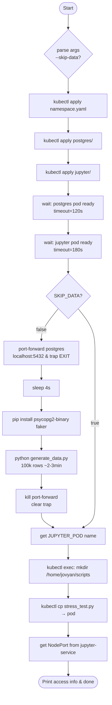

## to run provisioning

```mermaid
flowchart TD
    A([Start]) --> B{parse args\n--skip-data?}
    B --> C[kubectl apply namespace.yaml]
    C --> D[kubectl apply postgres/]
    D --> E[kubectl apply jupyter/]
    E --> F[wait: postgres pod ready\ntimeout=120s]
    F --> G[wait: jupyter pod ready\ntimeout=180s]
    G --> H{SKIP_DATA?}

    H -- false --> I[port-forward postgres\nlocalhost:5432 & trap EXIT]
    I --> J[sleep 4s]
    J --> K[pip install psycopg2-binary faker]
    K --> L[python generate_data.py\n100k rows ~2-3min]
    L --> M[kill port-forward\nclear trap]
    M --> N

    H -- true --> N[get JUPYTER_POD name]
    N --> O[kubectl exec: mkdir /home/jovyan/scripts]
    O --> P[kubectl cp stress_test.py → pod]
    P --> Q[get NodePort from jupyter-service]
    Q --> R([Print access info & done])
```